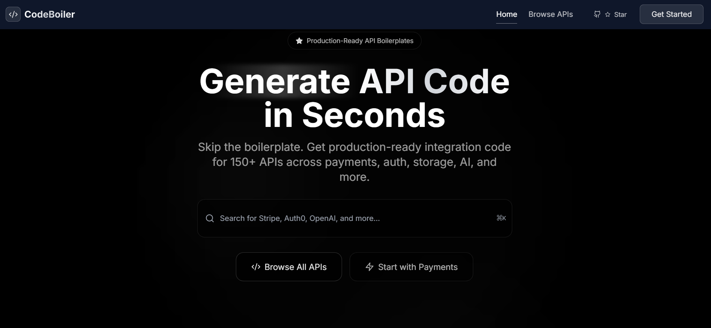
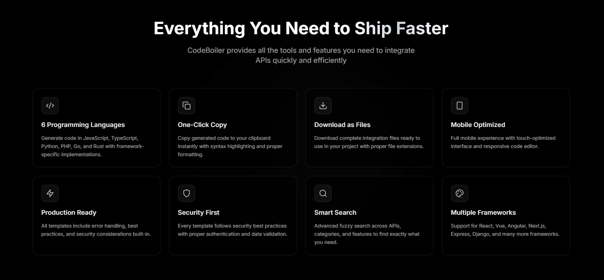
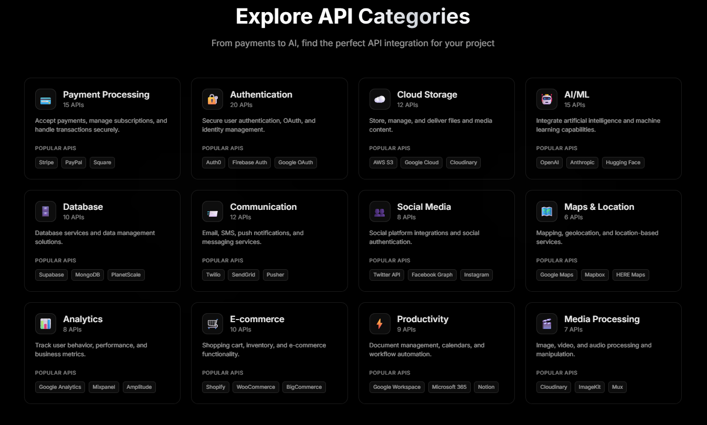
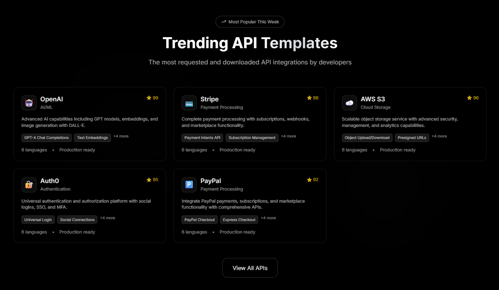
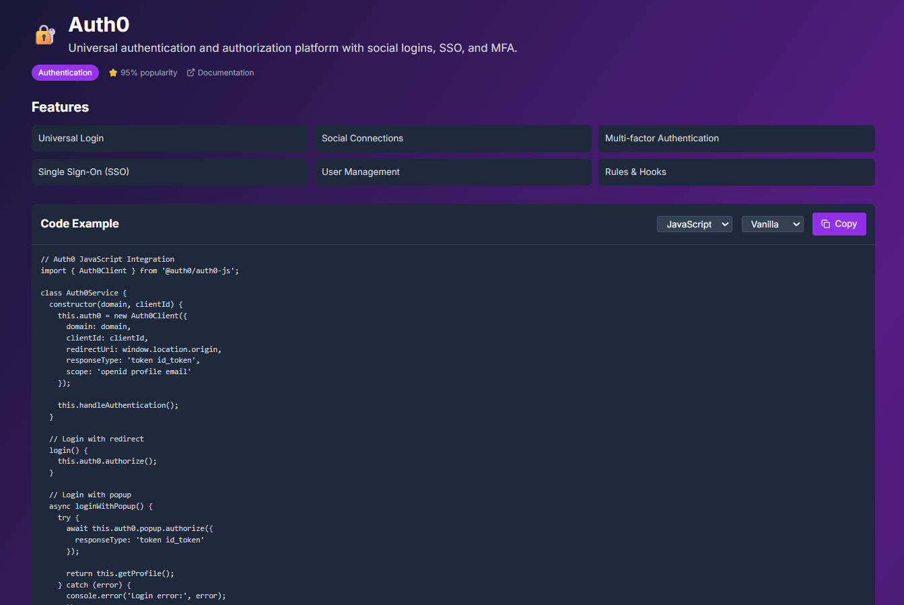

# CodeBoiler - API Boilerplate Code Generator

🚀 **Production-Ready API Integration Templates**

[](https://github.com/shivas1432/Boilerplate-codes-Web-App)
[](CONTRIBUTING.md)
[](LICENSE)
[](https://your-demo-link.com)

> **🤝 Open Source Contributions Welcome!**  
> We're actively seeking contributors to help expand our collection of API boilerplate codes. Whether you're a beginner or expert developer, your contributions to add new API templates, improve existing code, or enhance documentation are highly valued. Join our growing community of developers! 

CodeBoiler is a comprehensive web application that generates production-ready API integration code for 150+ services across 12 categories. Built with Next.js, TypeScript, and Tailwind CSS.

## 🌟 Live Demo

**Try it now:** [https://your-demo-link.com](https://your-demo-link.com)

Experience CodeBoiler's powerful features and generate production-ready API code in seconds!

## 📱 Demo Screenshots

<div align="center">

### 🏠 **Homepage - Matte Black Theme**

*Modern dark interface with smooth animations and search functionality*

### 📚 **API Browser**
 
*Browse 150+ APIs across 12 categories with advanced filtering*

### 💻 **Code Generation**

*Real-time code generation with Monaco Editor and syntax highlighting*

### 📊 **API Categories** 

*Organized API categories with popular templates highlighted*

### ⚡ **Features Overview**

*Comprehensive feature set for modern API integration*

</div>

## ✨ Features

### 🎯 Core Functionality
- **150+ API Templates** - Complete, working code examples
- **6 Programming Languages** - JavaScript, TypeScript, Python, PHP, Go, Rust
- **Multiple Frameworks** - React, Vue, Angular, Next.js, Django, Laravel, and more
- **Real-time Code Generation** - Monaco Editor with syntax highlighting
- **Advanced Search** - Fuzzy search across APIs, categories, and features
- **Mobile Optimized** - Touch-friendly interface with responsive design

### 🛠 API Categories
- **Payment Processing** (15 APIs) - Stripe, PayPal, Square, Razorpay, etc.
- **Authentication** (20 APIs) - Auth0, Google OAuth, Firebase Auth, etc.
- **Cloud Storage** (12 APIs) - AWS S3, Google Cloud, Cloudinary, etc.
- **AI/ML** (15 APIs) - OpenAI, Anthropic, Hugging Face, etc.
- **Database** (10 APIs) - Supabase, MongoDB, PlanetScale, etc.
- **Communication** (12 APIs) - Twilio, SendGrid, Pusher, etc.
- **Social Media** (8 APIs) - Twitter, Facebook, Instagram, etc.
- **Maps & Location** (6 APIs) - Google Maps, Mapbox, HERE, etc.
- **Analytics** (8 APIs) - Google Analytics, Mixpanel, etc.
- **E-commerce** (10 APIs) - Shopify, WooCommerce, etc.
- **Productivity** (9 APIs) - Google Workspace, Notion, etc.
- **Media Processing** (7 APIs) - Cloudinary, ImageKit, etc.

### 🎨 Design & UX
- **Dark Theme** - Professional dark blue backgrounds with purple accents
- **Modern Typography** - Inter font family with proper hierarchy  
- **Smooth Animations** - Framer Motion for seamless interactions
- **Card-based Layout** - Clean, organized interface
- **Performance Optimized** - Static generation, code splitting, lazy loading

## 🚀 Quick Start

### Prerequisites
- Node.js 18+ 
- npm or yarn

### Installation

1. **Clone the repository**
   ```bash
   git clone https://github.com/shivashanker1432/codeboiler.git
   cd codeboiler
   ```

2. **Install dependencies**
   ```bash
   npm install
   ```

3. **Start development server**
   ```bash
   npm run dev
   ```

4. **Open your browser**
   Navigate to `http://localhost:3000`

### Build for Production

```bash
npm run build
npm run export
```

The static files will be generated in the `dist` directory, ready for deployment to any static hosting service.

## 🏗 Project Structure

```
codeboiler/
├── app/                    # Next.js 14 App Router
│   ├── layout.tsx         # Root layout with theme
│   ├── page.tsx           # Homepage
│   ├── browse/            # API browser page
│   └── api/[slug]/        # Individual API pages
├── components/            # React components
│   ├── ui/               # Reusable UI components
│   ├── layout/           # Navigation, footer
│   ├── sections/         # Homepage sections
│   ├── search/           # Search functionality
│   ├── api/              # API-related components
│   ├── filters/          # Category filters
│   └── code-editor/      # Monaco Editor integration
├── lib/                  # Utility libraries
│   ├── api-data.ts       # API templates and data
│   ├── search.ts         # Search functionality
│   └── code-generator.ts # Code generation logic
├── types/                # TypeScript definitions
└── public/              # Static assets
```

## 🔧 Technical Stack

- **Framework**: Next.js 14 with App Router
- **Language**: TypeScript
- **Styling**: Tailwind CSS with custom theme
- **Animations**: Framer Motion
- **Search**: Fuse.js for fuzzy search
- **Code Editor**: Monaco Editor
- **Icons**: Lucide React
- **Notifications**: React Hot Toast

## 📱 Browser Support

- **Desktop**: Chrome, Firefox, Safari, Edge (latest 2 versions)
- **Mobile**: iOS Safari, Chrome Mobile, Samsung Internet
- **Features**: Full ES6+ support, WebAssembly, Service Workers

## 🎯 Usage Examples

### Basic API Integration

1. **Browse APIs** - Visit `/browse` to explore all available templates
2. **Search & Filter** - Use the search bar or category filters to find specific APIs
3. **Generate Code** - Select an API to view the integration page
4. **Customize** - Choose your preferred language and framework
5. **Copy or Download** - Get the generated code instantly

### Code Generation

```typescript
// Example: Stripe Payment Integration
const stripe = new StripePayments('sk_test_...');

const result = await stripe.createPaymentIntent(29.99, 'usd');
if (result.success) {
  console.log('Payment Intent:', result.paymentIntentId);
}
```

### Search Functionality

```javascript
// Advanced search with filters
const results = searchAPIs(apis, 'stripe payment', {
  category: 'payment',
  language: 'typescript'
});
```

## 🛡 Security Best Practices

All generated code templates include:

- **API Key Security** - Environment variable usage
- **Input Validation** - Parameter sanitization
- **Error Handling** - Comprehensive error management
- **Rate Limiting** - Built-in request throttling
- **HTTPS Enforcement** - Secure communication protocols
- **Authentication** - Proper token handling

## 🎨 Customization

### Theme Configuration

Edit `tailwind.config.js` to customize colors, fonts, and spacing:

```javascript
module.exports = {
  theme: {
    extend: {
      colors: {
        primary: {
          500: '#a855f7', // Purple accent
          600: '#9333ea',
        },
        dark: {
          800: '#1e293b', // Background colors
          900: '#0f172a',
        }
      }
    }
  }
}
```

### Adding New API Templates

1. Add your API template to `lib/api-data.ts`
2. Include code examples for all supported languages
3. Add proper categorization and metadata
4. Update category counts and popular APIs lists

### Language Support

To add a new programming language:

1. Update the `Language` type in `types/api.ts`
2. Add language selector option in `LanguageSelector.tsx`
3. Implement code generation logic in `code-generator.ts`
4. Add syntax highlighting support in Monaco Editor

## 📊 Performance

- **Lighthouse Scores**: 95+ across all categories
- **First Contentful Paint**: < 1.2s
- **Largest Contentful Paint**: < 2.5s
- **Cumulative Layout Shift**: < 0.1
- **Bundle Size**: < 500KB gzipped

## 🚀 Deployment

### Static Hosting (Recommended)

CodeBoiler generates static files that can be deployed to:

- **Netlify** - Drag and drop the `dist` folder
- **Vercel** - Connect your Git repository
- **GitHub Pages** - Push to `gh-pages` branch
- **AWS S3** - Upload to S3 bucket with static hosting
- **Cloudflare Pages** - Connect repository or upload files

### CDN Configuration

For optimal performance, configure your CDN to:
- Cache static assets for 1 year
- Enable Brotli/Gzip compression
- Set proper MIME types for all file extensions
- Enable HTTP/2 Push for critical resources

## 🤝 Contributing

We welcome contributions! Please see our [Contributing Guide](CONTRIBUTING.md) for details.

### Ways to Contribute

- 🔧 **Add New API Templates** - Expand our library with new API integrations
- 🐛 **Bug Fixes** - Help us squash bugs and improve stability
- 📚 **Documentation** - Improve guides, examples, and API docs
- 🎨 **UI/UX** - Enhance user interface and experience
- ⚡ **Performance** - Optimize code and improve loading times
- 🌐 **Translations** - Add support for multiple languages

### Development Setup

1. Fork the repository
2. Create a feature branch: `git checkout -b feature/amazing-api`
3. Make your changes
4. Add tests if applicable
5. Commit your changes: `git commit -m 'Add amazing API template'`
6. Push to your branch: `git push origin feature/amazing-api`
7. Submit a pull request

### API Template Guidelines

When adding new API templates:
- Include complete, working examples
- Add comprehensive error handling
- Follow security best practices
- Support multiple frameworks where applicable
- Include detailed documentation links

## 👨‍💻 Author

**Kanugula Shivashanker**
- **Full-Stack Developer** | React, Node.js, Express, MySQL
- **GitHub**: [@shivashanker1432](https://github.com/shivashanker1432)
- **LinkedIn**: [Shivashanker Kanugula](https://www.linkedin.com/in/shivashanker-kanugula-51a519252)
- **Portfolio**: [shivashanker.com](https://www.shivashanker.com)
- **Email**: [hello@shivashanker.com](mailto:hello@shivashanker.com)

*Passionate about building dynamic web apps | Continuous learner | Open to collaboration*

## 📜 License

MIT License - see [LICENSE](LICENSE) for details.

## 🙏 Acknowledgments

- **OpenAI** - For GPT model integration examples
- **Stripe** - For comprehensive payment API documentation
- **Next.js Team** - For the excellent framework
- **Tailwind CSS** - For the utility-first CSS framework
- **Monaco Editor** - For the code editor component
- **All Contributors** - Thank you for making this project better!

## 📞 Support & Community

- **Documentation**: [docs.codeboiler.dev](https://docs.codeboiler.dev)
- **Issues**: [GitHub Issues](https://github.com/shivashanker1432/codeboiler/issues)
- **Discussions**: [GitHub Discussions](https://github.com/shivashanker1432/codeboiler/discussions)
- **Feature Requests**: [Create an Issue](https://github.com/shivashanker1432/codeboiler/issues/new)

## ⭐ Show Your Support

If this project helped you, please consider giving it a ⭐ star on GitHub! Your support means a lot and helps others discover the project.

---

<div align="center">
  <strong>Built with ❤️ by Shivashanker for the developer community</strong>
  <br>
  <a href="https://codeboiler.dev">🌐 Visit CodeBoiler</a> • 
  <a href="https://github.com/shivashanker1432">👨‍💻 Follow on GitHub</a> • 
  <a href="https://www.linkedin.com/in/shivashanker-kanugula-51a519252">💼 Connect on LinkedIn</a>
</div>
